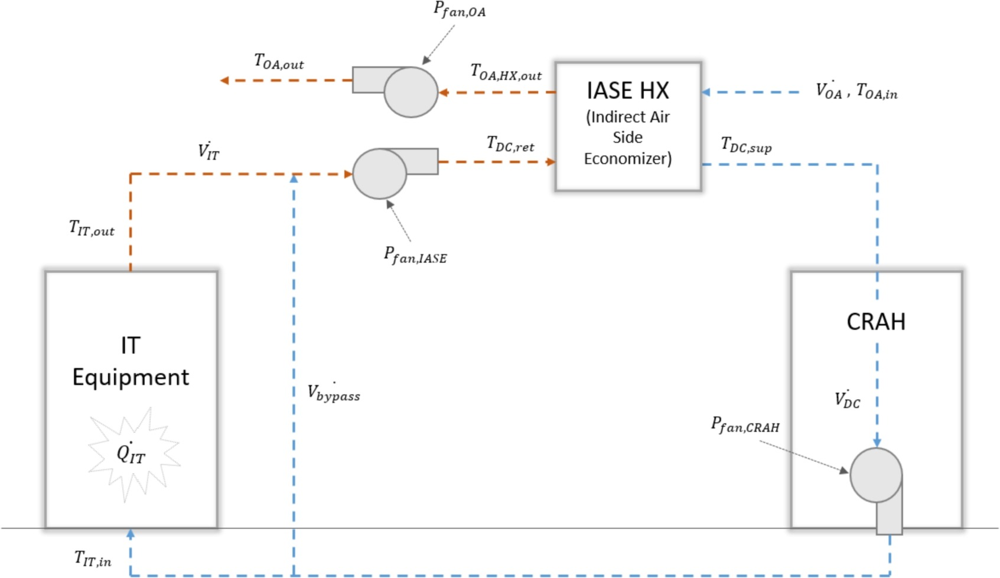
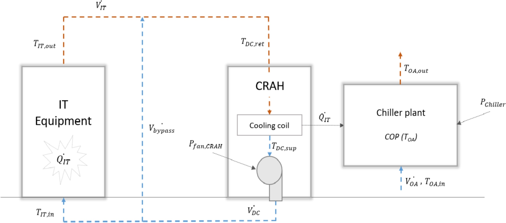

# ThermoDynamic Model of a Hyperscale Data Centre (HDC-TDM)

This is a python implementation of the thermodanamic model developed by Alessandro Colangelo for his [Master thesis][Alessandro's thesis].

The original model has been used to, e.g. generate input to TIMES-DK to analyse [the role of data centres in the future Danish energy system][TIMES-DK DC paper].

## Using the model

Run `main.py` to execute the model.

`temperature.csv` contains an example of data input.

`output.csv` contains the corresponding output.

Check `dc_model.py` for other assumptions.

## Model description

A description of all model equations is included in Appendix A of [The role of data centres in the future Danish energy system][TIMES-DK DC paper].

Depending on the outdoor air temperature, two cooling modes can be performed: free cooling, through indirect airside economizer, and chiller mode. These are illustrated in the figures below.

### Free cooling mode

### Cooling produced by a chiller plant

## License

Copyright 2020-2022 Alessandro Colangelo, Stefan Petrović and Olexandr Balyk.

HDC-TDM is licensed under the Apache License, Version 2.0.

You may obtain a copy of the License here or at http://www.apache.org/licenses/LICENSE-2.0.

[Alessandro's thesis]: https://www.sys.man.dtu.dk/-/media/Centre/SYS_Systems_Analysis/Master-Theses/AColangelo_Master_Thesis_DTU.ashx?la=da&hash=626BCB6F1CAA882326E384E6EABE3647877E50CB
[TIMES-DK DC paper]: https://doi.org/10.1016/j.energy.2020.116928
